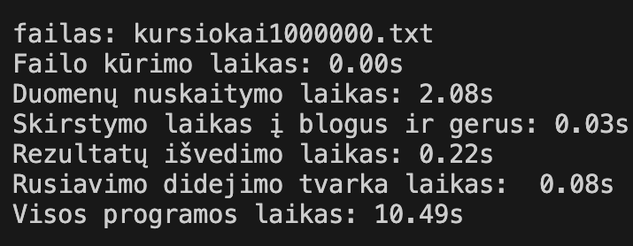

Testavimo sistemos parametrai:  
CPU - Apple M2 chip, 8-core  
RAM - 8GB  
SSD - 256GB  
----------------------------------------------------------------------------------------

1 Strategija:  

vect: 

2 strategija:  

Greičiausiai veikianti strategija:  

Kaip naudotis...

1. 

