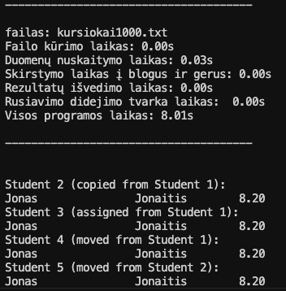
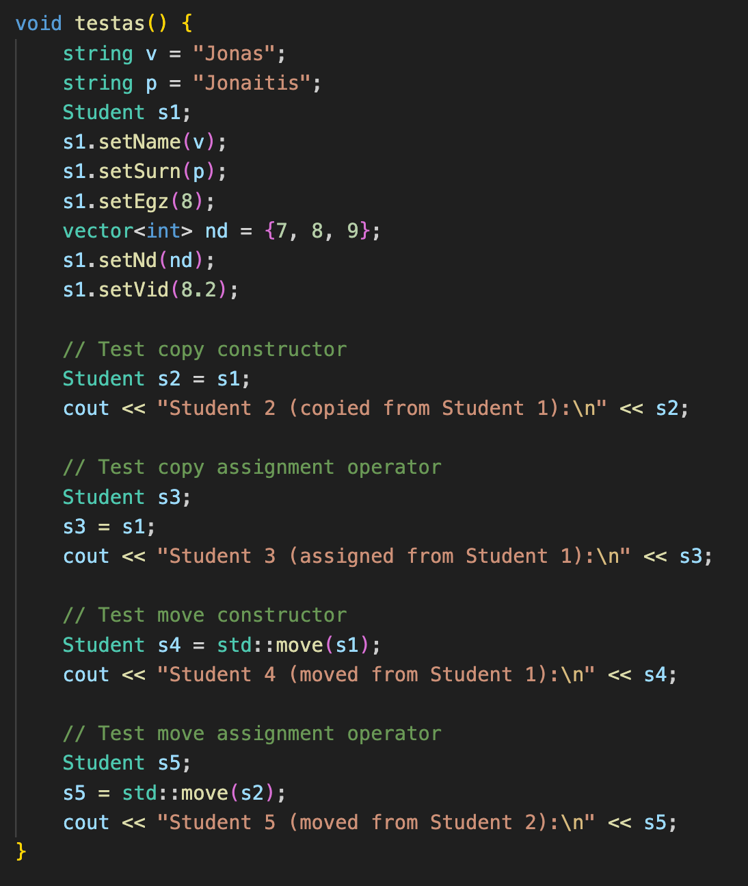

Ši programa leidžia:

Įvesti studentų duomenis rankiniu būdu, automatiškai arba iš failo
Apskaičiuoti galutinį pažymių rezultatą pagal vidurkį arba medianą
Skirstyti studentus į dvi grupes: pažangius ir nepažangius pagal dvi strategijas
Rezultatus išvesti į ekraną arba į failus alfos.txt ir susmukeliai.txt
Rūšiuoti studentus pagal vardą, pavardę arba galutinį rezultatą

Perdengtų metodų paaiškinimas 

-------------------------- Įvesties būdai ---------------------------
| Tipas       | Realizacija                      | Aprašymas                                        |
|-------------|----------------------------------|--------------------------------------------------|
| Rankinis    | pasirinkimas == 1                | Vartotojas suveda vardą, pavardę, ND ir egzaminą |
| Pusiau auto | pasirinkimas == 2                | Automatiškai generuojami tik pažymiai            |
| Automatinis | pasirinkimas == 3                | Visi duomenys sugeneruojami automatiškai         |
| Iš failo    | failo pasirinkimas == 1,2,3,4,5  | Visi duomenys sugeneruojami kursiokai.txt faile  |

-------------------------- Išvesties būdai ---------------------------
| Tipas    | Realizacija                     | Failai                                        |
|----------|---------------------------------|-----------------------------------------------|
| Ekranas  | pasirinkimas == 1, spausdinam() | Duomenys išvedami į ekraną pagal rikiavimą    |
| Į failą  | pasirinkimas == 2, spausdinam() | Sukuriami alfos.txt ir susmukeliai.txt        |

 

 

==== REZULTATŲ LENTELĖ ====
| Veiksmas                        | V1.0 (1M) | V1.1 (1M) |  V1.0 (10M) |  V1.1 (10M) |
|---------------------------------|-----------|-----------|-------------|-------------|
| Failo kūrimo laikas             |   3.15s   |   3.02s   |   29.61s    |   29.57s    |
| Duomenų nuskaitymo laikas       |   7.54s   |   8.08s   |   76.73s    |   82.71s    |
| Skirstymo laikas                |   0.84s   |   1.14s   |    9.70s    |   12.18s    |
| Rezultatų išvedimo laikas       |   0.40s   |   0.39s   |    3.96s    |    4.25s    |
| Rūšiavimo tvarka laikas         |   0.04s   |   0.18s   |    0.45s    |    1.69s    |
|---------------------------------|-----------|-----------|-------------|-------------|
| Visos programos laikas          |   18.68s  |   21.86s  |   136.59s   |   146.66s   |

 ==== FLAGŲ PALYGINIMAS ====
| Veiksmas                        |  V1 -O1 |  V1 -O2 |  V1 -O3 |  V1.1 -O1 |  V1.1 -O2 |  V1.1 -O3 |
|---------------------------------|---------|---------|---------|-----------|-----------|-----------|
| Failo kūrimo laikas             |  2.96s  |  2.99s  |  3.00s  |   2.97s   |   3.01s   |   2.97s   |
| Duomenų nuskaitymo laikas       |  7.48s  |  7.51s  |  7.53s  |   8.09s   |   8.09s   |   8.09s   |
| Skirstymo į blogus/gerus laikas |  0.84s  |  0.83s  |  0.83s  |   1.14s   |   1.15s   |   1.15s   |
| Rezultatų išvedimo laikas       |  0.40s  |  0.40s  |  0.40s  |   0.42s   |   0.40s   |   0.45s   |
| Rūšiavimo tvarka laikas         |  0.03s  |  0.03s  |  0.04s  |   0.18s   |   0.18s   |   0.18s   |
|---------------------------------|---------|---------|---------|-----------|-----------|-----------|
| Visos programos laikas          | 19.06s  |  19.32s |  18.03s |   18.01s  |   17.16s  |   17.05s  |