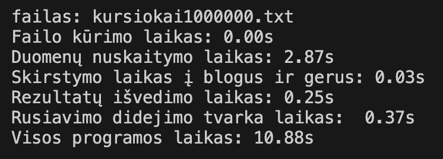

Testavimo sistemos parametrai:  
CPU - Apple M2 chip, 8-core  
RAM - 8GB  
SSD - 256GB  
----------------------------------------------------------------------------------------

1 Strategija:  

vect:  

 

list:  

 

deque:  

 

2 strategija:  

vect:  

 

list:  

 

deque:  

 

Greičiausiai veikianti strategija:  

vect:  

Kaip naudotis... 

1. atsisiuskite zip faila
2. atsidare programos koda, terminale parašykite "make"
3. tada terminale parašykite "./vect" arba "./list" arba "./deque"

